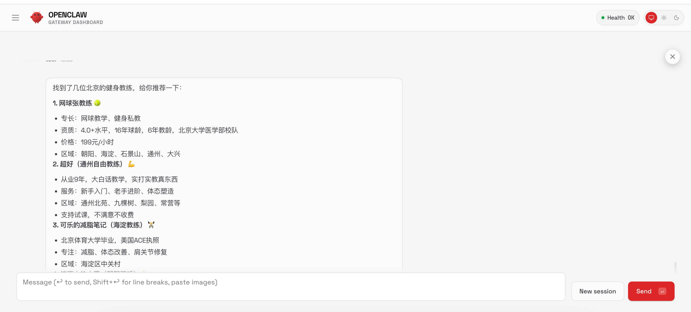

# 千喵 Skills

千喵是一个基于 openclaw 平台的需求发布与人才匹配技能包，帮助用户快速发布需求并找到合适的解决方案提供者。

## 功能特性

- 🎯 **需求发布**：便捷地发布各类服务需求
- 👥 **智能匹配**：根据需求条件精准匹配合适的人才
- 🌍 **地理定位**：支持按省市区域筛选匹配结果
- 💰 **价格筛选**：设置预算范围找到性价比最优方案
- 📱 **API集成**：通过标准 API 接口实现自动化匹配

## 安装指南

### 1. 克隆仓库

```bash
git clone https://github.com/keman-ai/qianmiao-skills.git
cd qianmiao-skills
```

### 2. 配置 openclaw 工作空间

```bash
mkdir -p ~/.openclaw/workspace/skills
cp -r findu-skills ~/.openclaw/workspace/skills/
```

### 3. 配置 API 密钥

编辑密钥配置文件：

```bash
vim ~/.openclaw/workspace/skills/findu-skills/references/secrets/config.sh
```

添加你的应用密钥：
```bash
export APP_KEY="your_app_key_here"
```

## 在 openclaw 中使用千喵

### 启动 openclaw

确保你已经安装并启动了 openclaw 平台。

### 使用场景

#### 发布新需求

当你需要寻找特定服务提供者时：

```
我想找个健身教练，预算500元，在广东省
```

系统将自动：
- 收集需求详细信息
- 调用匹配接口
- 返回符合条件的服务提供者列表

#### 查询现有匹配

直接询问相关问题：

```
帮我找心理咨询师，价格不超过300元
```

#### 修改筛选条件

可以随时调整搜索条件：

```
把搜索范围限制在北京地区
把预算提高到800元
```

### 实际使用示例

#### 示例1：查找健身教练

**用户输入：**
```
给我推荐几个健身教练，北京的
```

**预期输出：**
系统会展示符合条件的北京地区健身教练列表，包含姓名、价格、评分等信息。




## 技能目录结构

```
findu-skills/
├── SKILL.md                    # 技能描述文件
├── scripts/
│   └── exec.sh                # 执行脚本
├── references/
│   ├── apis/
│   │   └── findPersonByQuery.md  # API 接口文档
│   └── secrets/
│       └── config.sh          # 密钥配置文件
```
## 常见问题

### Q: 如何获取 APP_KEY？
A: 请联系千喵平台管理员申请开发者密钥。

### Q: 匹配结果不准确怎么办？
A: 可以尝试提供更多详细信息，如具体城市、更精确的服务描述等。

### Q: 支持哪些服务类型？
A: 目前支持多种服务类型，包括但不限于：教育培训、生活服务、专业咨询、技能培训等。

### Q: 支持批量查询吗？
A: 当前版本支持单次查询，可以通过循环调用实现批量处理。

## 更新日志

### v1.0.0 (2026-02-11)
- ✨ 初始版本发布


### 即将推出


## 贡献指南
欢迎提交 Issue 和 Pull Request 来改进这个项目。

### 开发环境搭建
1. Fork 本项目
2. 创建功能分支：`git checkout -b feature/your-feature`
3. 提交更改：`git commit -am 'Add some feature'`
4. 推送到分支：`git push origin feature/your-feature`
5. 创建 Pull Request

## 社区和支持

- 📧 邮件支持：
- 💬 微信群：
- 🐛 问题反馈：

## 许可证

Apache License 2.0

---

*Powered by 科漫智能*
